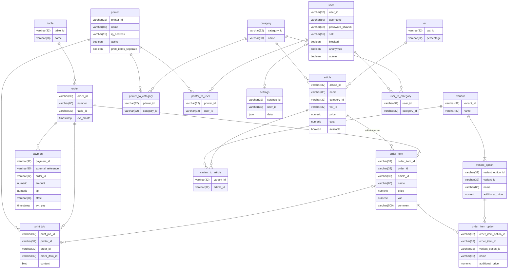

# Gourmetgate Entity Relationship Diagram

```mermaid
erDiagram
    category {
        varchar(32) category_id
        varchar(80) name
    }
    article {
        varchar(32) article_id
        varchar(80) name
        varchar(32) category_id
        varchar(32) var_id
        numeric price
        numeric cost
        boolean available
    }
    order {
        varchar(32) order_id
        varchar(80) number
        varchar(32) table_id
        timestamp evt_create
    }
    order_item {
        varchar(32) order_item_id
        varchar(32) order_id
        varchar(32) article_id
        varchar(80) name
        numeric price
        numeric vat
        varchar(500) comment
    }
    order_item_option {
        varchar(32) order_item_option_id
        varchar(32) order_item_id
        varchar(32) variant_option_id
        varchar(80) name
        numeric additional_price
    }
    payment {
        varchar(32) payment_id
        varchar(80) external_reference
        varchar(32) order_id
        numeric amount
        numeric tip
        varchar(80) state
        timestamp evt_pay
    }
    printer {
        varchar(32) printer_id
        varchar(80) name
        varchar(15) ip_address
        boolean active
        boolean print_items_separate
    }
    print_job {
        varchar(32) print_job_id
        varchar(32) printer_id
        varchar(32) order_id
        varchar(32) order_item_id
        blob content
    }
    printer_to_category {
        varchar(32) printer_id
        varchar(32) category_id
    }
    printer_to_user {
        varchar(32) printer_id
        varchar(32) user_id
    }
    settings {
        varchar(32) settings_id
        varchar(32) user_id
        json data
    }
    table {
        varchar(32) table_id
        varchar(80) name
    }
    variant {
        varchar(32) variant_id
        varchar(80) name
    }
    variant_option {
        varchar(32) variant_option_id
        varchar(32) variant_id
        varchar(80) name
        numeric additional_price
    }
    variant_to_article {
        varchar(32) variant_id
        varchar(32) article_id
    }
    vat {
        varchar(32) vat_id
        varchar(32) percentage
    }
    user {
        varchar(32) user_id
        varchar(80) username
        varchar(32) password_sha256
        varchar(16) salt
        boolean blocked
        boolean anonymus
        boolean admin
    }
    user_to_category {
        varchar(32) user_id
        varchar(32) category_id
    }
    category ||--o{ article: ""
    article ||--o{ order_item: "soft reference"
    order ||--|{ order_item: ""
    order_item ||--o{ order_item_option: ""
    table ||--o{ order: ""
    vat ||--o{ article: ""
    variant_option ||--o{ order_item_option: ""
    order ||--o{ payment: ""
    printer ||--o{ print_job: ""
    order ||--o{ print_job: ""
    order_item |o--o{ print_job: ""
    printer ||--o{ printer_to_category: ""
    category ||--o{ printer_to_category: ""
    printer ||--o{ printer_to_user: ""
    user ||--o{ printer_to_user: ""
    user |o--o| settings: ""
    variant ||--|{ variant_option: ""
    variant ||--o{ variant_to_article: ""
    article ||--o{ variant_to_article: ""
    user ||--o{ user_to_category: ""
    category ||--o{ user_to_category: ""
```
