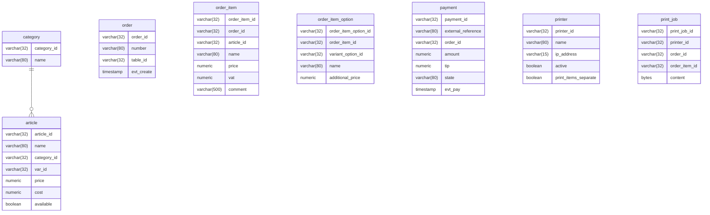

# Gourmetgate Entity Relationship Diagram

```mermaid
erDiagram
    category ||--o{ article: ""
    category {
        varchar(32) category_id
        varchar(80) name
    }
    article {
        varchar(32) article_id
        varchar(80) name
        varchar(32) category_id
        varchar(32) var_id
        numeric price
        numeric cost
        boolean available
    }
    order {
        varchar(32) order_id
        varchar(80) number
        varchar(32) table_id
        timestamp evt_create
    }
    order_item {
        varchar(32) order_item_id
        varchar(32) order_id
        varchar(32) article_id
        varchar(80) name
        numeric price
        numeric vat
        varchar(500) comment
    }
    order_item_option {
        varchar(32) order_item_option_id
        varchar(32) order_item_id
        varchar(32) variant_option_id
        varchar(80) name
        numeric additional_price
    }
    payment {
        varchar(32) payment_id
        varchar(80) external_reference
        varchar(32) order_id
        numeric amount
        numeric tip
        varchar(80) state
        timestamp evt_pay
    }
    printer {
        varchar(32) printer_id
        varchar(80) name
        varchar(15) ip_address
        boolean active
        boolean print_items_separate
    }
    print_job {
        varchar(32) print_job_id
        varchar(32) printer_id
        varchar(32) order_id
        varchar(32) order_item_id
        bytes content
    }
```
