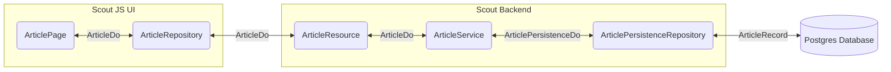

# Tech Stack

The technical building blocks of the software.

## Overview

### Diagram

### Technology

- Database: A relational postgres database stores all data.
- Backend Server: A stateless REST server, written in Java using the Eclipse Scout framework serving and processing
  data.
- User Interface: A frontend which uses HTML, LESS & TypeScript, based on the Eclipse Scout JS framework.
- Printplate: A proxy application which receives print jobs from the backend server and sends them to the printers in
  the local network.

## Database

The database is a relational postgres database. The data of the application is highly structured, therefore a relational
database is the optimal choice for this kind of software.

## Backend Server

The backend server is a Java application, using the Eclipse Scout Framework. The backend is serving a stateless REST API
which lets the frontend fetch data from the database. The backend consists of three layers: persistence, core and api.

### Persistence Layer

The persistence layer of the backend server interacts with the database. It reads and writes data from and to the
database and passes it to the core layer. The main library used in the persistence layer
is [JOOQ](https://www.jooq.org/).

jOOQ generates Java code from the database and lets you build type safe SQL queries through its fluent API. Those
queries are written in the `PersistenceRepository` class of the corresponding entity. The article entity has a class
called
`ArticlePersistenceRepository` where all database operations with this are performed.

Because jOOQ is a database-first library, the java code gets generated based on the database schema. To generate the
schema, classical Hibernate entities are used. To not make a mess between the two technologies, Hibernate is never used
in the project for any data operations, only for schema definition and database migrations.

The persistence layer delivers and receives data as `DataObject` form the core layer, where the main part of the
business logic lives.

### Core Layer

The purpose of the core layer is to transform data, and the main place where business logic is applied. Note that not
all business logic is in the backend. For each operation, a tradeoff must be made, where the business logic should be
implemented.

Examples for server-side business logic:

- Validation of critical data
- Sanitizing of user input
- Heavy data transformation
- Authentication
- Etc.

Examples for ui-side business logic:

- Pre-validation
- Simple data transformation
- Caching
- Etc.

The core layer consists of services. Per entity or entity group, there is a service class, e.g. `ArticleService` where
the server-side business logic is implemented. The service operates with data objects.

A `DataObject` always has the structure as specified in the API documentation. In some cases, the structure defined in
the API differs from the structure in the Database. When this happens two `DataObjects` are created. The one which has
the API structure is named after the entity with `Do` as suffix. The database data object is suffixed with `EntityDo`.
When the structure is the same in database and API, the API data object is directly passed to the persistence layer.

Example for the article entity:

- API data object: `ArticleDo`
- Database data object: `ArticlePersistenceDo`

This generates more complexity and an additional transformation step, but ensures a clean handling of data.

### API Layer

In the API layer is the place, where REST resources are defined, exactly as documented in the OpenAPI specification. The
API Layer is responsible for permission checking.

The entire backend server is stateless implemented. The only exception is the permission-check and authentication
mechanism, where the framework support is used.

## User interface

The user interfaces is built using widgets from the scout framework. The user interface is implemented in TypeScript.
The code is bundled using webpack and served by the backend server.

The UI requests data from the backend using `Repositories`. A repository contains the implementation to request the
endpoint. The Repository in the UI is the other side of the API layer of the backend server. The repository may also
transform the data to make it usable for the UI widgets.

The UI widgets delegate all data operations to the Repositories. The widget is responsible for rendering the data. It is
important, to reduce the amount of calls to the backend. Rather make a call with a lot of data than make multiple calls. 

## Technical Diagram

