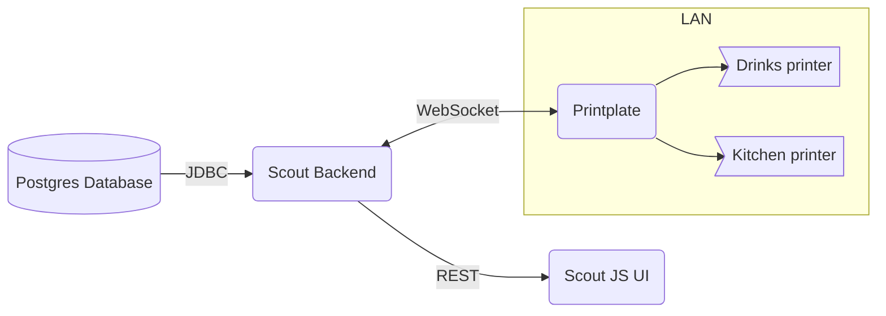

# Tech Stack

The technical building blocks of the software. 

## Overview

graph TB
    c1-->a2
    subgraph one
    a1-->a2
    end
    subgraph two
    b1-->b2
    end
    subgraph three
    c1-->c2
    end

## Database

A relational postgres database stores all data.

## Backend Server

A stateless REST server, written in Java using the Eclipse Scout framework serving and processing data. 

## User Interface

A frontend which uses HTML, LESS & TypeScript, based on the Eclipse Scout JS framwework. 

## Printplate

A proxy application which receives print jobs from the backend server and sends them to the printers in the local network.